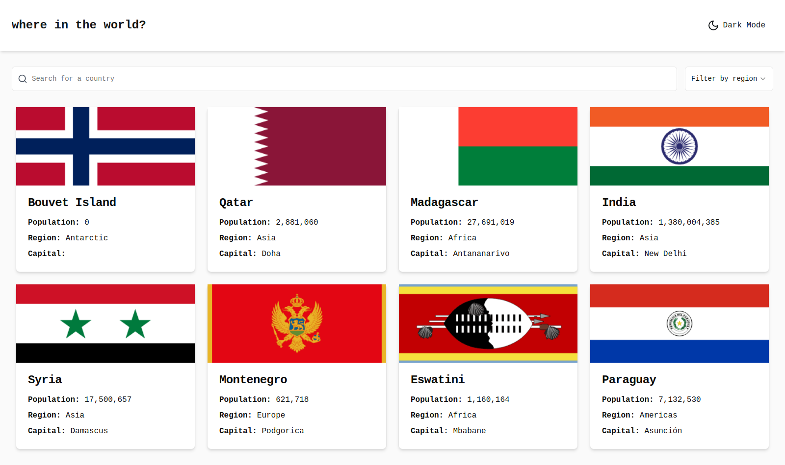
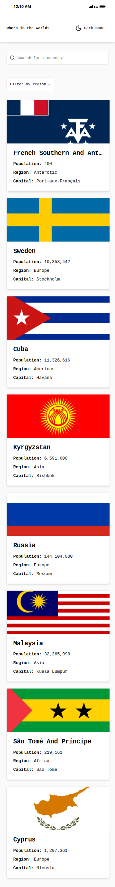
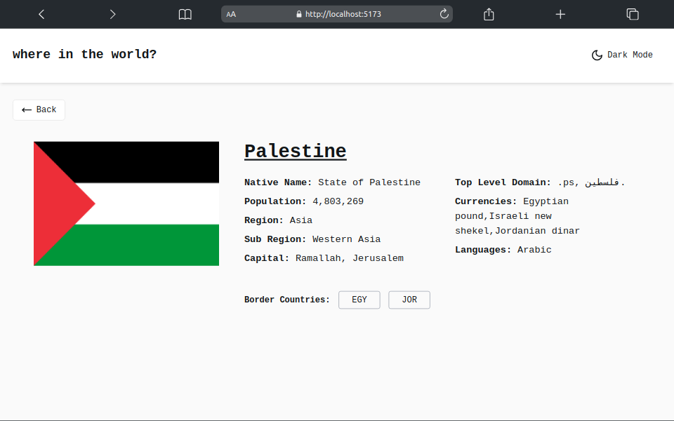
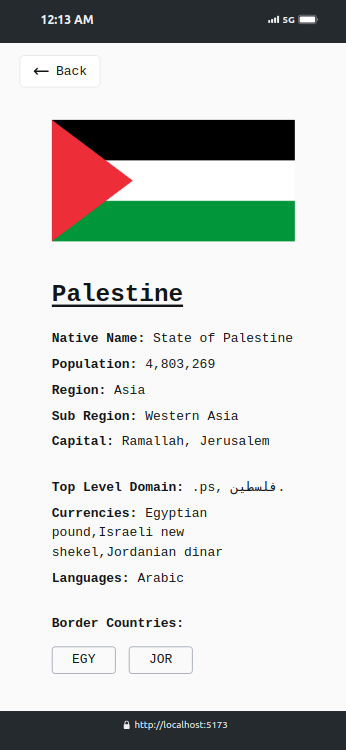
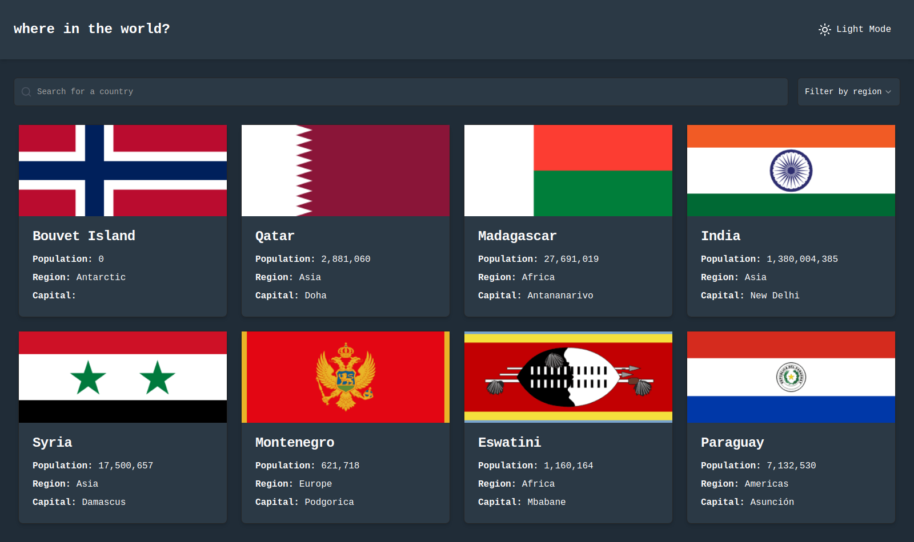
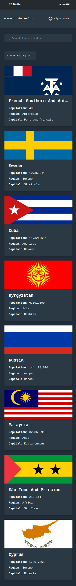
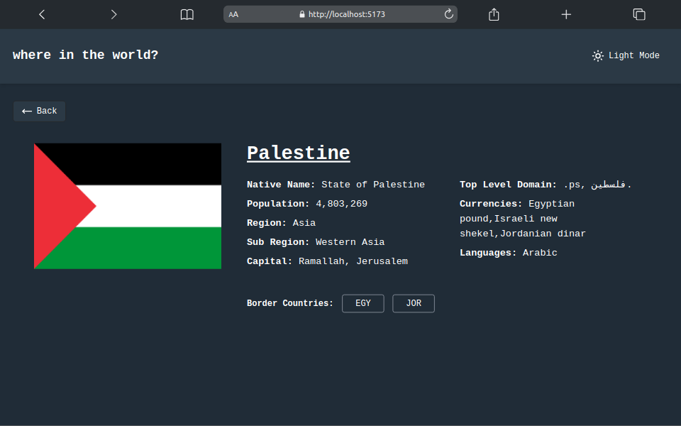

# Frontend Mentor - REST Countries API with color theme switcher solution

This is a solution to the [REST Countries API with color theme switcher challenge on Frontend Mentor](https://www.frontendmentor.io/challenges/rest-countries-api-with-color-theme-switcher-5cacc469fec04111f7b848ca).

## Table of contents

-   [Overview](#overview)
    -   [The challenge](#the-challenge)
    -   [Screenshot](#screenshot)
    -   [Links](#links)
-   [My process](#my-process)
    -   [Built with](#built-with)
-   [Author](#author)

**Note: Delete this note and update the table of contents based on what sections you keep.**

## Overview

### The challenge

Users should be able to:

-   See all countries from the API on the homepage
-   Search for a country using an `input` field
-   Filter countries by region
-   Click on a country to see more detailed information on a separate page
-   Click through to the border countries on the detail page
-   Toggle the color scheme between light and dark mode _(optional)_

### Screenshot

### Links

-   Solution URL: [solution URL](https://www.frontendmentor.io/solutions/rest-countries-api-with-color-theme-switcher-8C5t3njTy5)
-   Live Site URL: [live site URL](https://frontend-mentor-countries-eight.vercel.app/)

### Built with

-   ReactJS
-   TypeScript
-   React-router-dom
-   TailwindCss
-   Shadcn/ui
-   lucide-react

## Author

-   Github - [Ahmed Lebda](https://github.com/AhmedLebda)
-   Frontend Mentor - [Ahmed Lebda](https://www.frontendmentor.io/profile/AhmedLebda)
